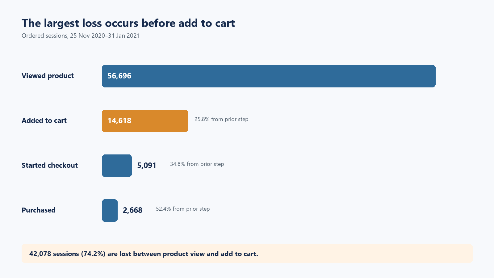
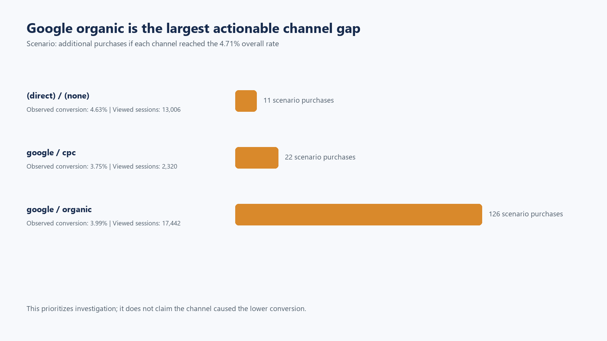
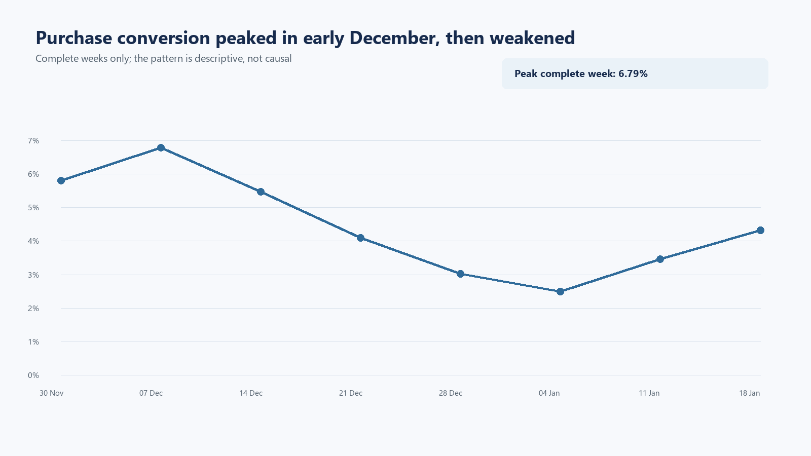

# GA4 Ecommerce Funnel Analysis

## Business question

At which stage of the ecommerce funnel are the largest user losses occurring, which segments contribute most to the missed purchase opportunity, and what should the product team investigate first?

## Answer

The first priority is the step from **product view to add to cart**. Of 56,696 ordered product-view sessions, 42,078 (74.2%) do not reach add to cart. The largest actionable segment gap is **Google organic**: 17,442 viewed sessions convert to purchase at 3.99%, compared with 4.71% overall. Reaching the overall rate is a transparent scenario of about 126 additional purchases, not a forecast.

The product team should first diagnose product-detail and add-to-cart friction in Google organic sessions, starting with the YouTube and Bags category paths. Device conversion is similar across desktop, mobile, and tablet, so device is not the primary lead.



The ordered funnel makes the first decision clear: the largest absolute and relative loss occurs before add to cart, so the analysis moves next to acquisition and product-category segments at that step.

## Data and tools

The analysis uses Google's public [GA4 obfuscated ecommerce sample](https://developers.google.com/analytics/bigquery/web-ecommerce-demo-dataset):

`bigquery-public-data.ga4_obfuscated_sample_ecommerce.events_*`

- Source period: 1 November 2020–31 January 2021 (92 days)
- Headline analysis period: 25 November 2020–31 January 2021 (68 days)
- Source volume: 4,295,584 events, 270,154 users, and 360,129 sessions

The later start is a data-quality decision. `add_to_cart` is absent on 18 dates and the final gap occurs on 24 November. Using the full period would artificially depress the first funnel step. The raw public event tables remain in BigQuery; this repository stores only the small aggregated query results needed to reproduce the case narrative and dashboard.

Tools: BigQuery SQL, Python, Jupyter Notebook, and Power BI.

## Analysis workflow

### 1. Validate event coverage

The first query checks whether every core funnel event is observed each day. The missing `add_to_cart` dates define the comparable analysis window.

```sql
COUNTIF(event_name = 'add_to_cart') AS add_to_cart_events
```

### 2. Build an ordered session funnel

A session reaches a stage only when events occur in this order:

`view_item → add_to_cart → begin_checkout → purchase`

```sql
view_ts IS NOT NULL AND cart_ts >= view_ts AS reached_cart,
view_ts IS NOT NULL AND cart_ts >= view_ts
  AND checkout_ts >= cart_ts AS reached_checkout,
view_ts IS NOT NULL AND cart_ts >= view_ts
  AND checkout_ts >= cart_ts
  AND purchase_ts >= checkout_ts AS reached_purchase
```

This avoids counting a purchase as a clean funnel completion when the required upstream events are missing or out of order. The ordered path contains 2,668 purchase sessions; 223 additional purchase sessions are excluded from the ordered funnel.

### 3. Compare segments

The same ordered funnel is calculated for device and first-user acquisition channel. A 500-view-session minimum is used for channel comparisons. In this public export, `traffic_source` describes first-user acquisition rather than session attribution.

```sql
SELECT
  segment_type,
  segment_value,
  COUNTIF(reached_view) AS view_sessions,
  SAFE_DIVIDE(COUNTIF(reached_purchase), COUNTIF(reached_view))
    AS view_to_purchase_rate
FROM segments
GROUP BY segment_type, segment_value
HAVING segment_type = 'Overall' OR view_sessions >= 500;
```



Google organic is the first channel to inspect because it combines a large viewed-session base with below-benchmark purchase conversion. The scenario sizes the gap; it does not attribute causality to the channel.

### 4. Size product-category opportunity

Item-category values are comparable for `view_item` and `add_to_cart`, but not for later checkout stages. Category opportunity therefore uses the view-to-cart step and translates the gap with the overall downstream cart-to-purchase rate:

```sql
GREATEST(
  0,
  ROUND(view_sessions * benchmark.view_to_cart_rate - cart_sessions)
) AS scenario_extra_carts,
GREATEST(
  0,
  ROUND(
    (view_sessions * benchmark.view_to_cart_rate - cart_sessions)
    * benchmark.cart_to_purchase_rate
  )
) AS scenario_extra_purchases
```

Only categories with at least 300 viewed sessions are evaluated. The result is a prioritization scenario, not a causal prediction.

## Findings

| Finding | Evidence | Implication |
|---|---:|---|
| Largest funnel loss | 42,078 sessions; 74.2% loss before add to cart | Diagnose product-page and cart-entry friction first |
| Overall purchase conversion | 2,668 / 56,696 = 4.71% | Benchmark for descriptive segment scenarios |
| Google organic gap | 3.99% conversion; scenario of 126 purchases | First actionable acquisition segment to inspect |
| YouTube category path | 19.75% view-to-cart vs 25.78% overall; scenario of 40 purchases | First product path to review |
| Device difference | Desktop 4.55%, mobile 4.93%, tablet 4.86% | Device is not the leading diagnostic hypothesis |

Purchase conversion peaked at 6.79% in the complete week starting 7 December and later weakened. This supports a time-based diagnostic follow-up, but the sample does not contain enough context to assign a cause.



## Recommendation

1. Add or validate diagnostics for stock status, price visibility, CTA exposure, add-to-cart errors, and product-page load time.
2. Review Google organic landing paths and the YouTube and Bags product categories first.
3. Check whether the December-to-January change remains after controlling for product mix and acquisition composition.
4. Turn the best-supported friction hypothesis into an A/B test with purchase conversion as the primary outcome and checkout errors and revenue per viewed session as guardrails.

## Experiment readiness

The next step is sized rather than left as a generic recommendation. Using the committed 4.71% purchase baseline, a test designed to detect a 10% relative lift requires approximately **33,264 viewed sessions per arm**. At the historical traffic rate, the lower-bound runtime is about **80 days** before enforcing a full-business-cycle rule.

The reproducible sizing, assignment unit, measurement contract, guardrails, and decision rule are documented in [outputs/experiment_plan.md](outputs/experiment_plan.md). This is a launch plan, not a claim that an experiment was run.

## Limitations

- The public dataset is obfuscated and contains `<Other>` and deleted acquisition values.
- `traffic_source` is first-user acquisition, not session-level attribution.
- Observed segment differences identify where to investigate; they do not prove causality.
- Product-category analysis stops at add to cart because later item-category values are not comparable.
- Scenario opportunity assumes benchmark performance and should not be treated as a forecast.

## Repository structure

```text
data/source/       Aggregated BigQuery results
data/processed/    Analysis-ready tables
data/powerbi/      Power BI input tables
sql/               BigQuery data-quality and analysis queries
scripts/           Reproducible analysis, charts, notebook, and BI build
notebooks/         Executed analytical walkthrough
outputs/charts/    README visuals
powerbi/project/   Power BI Project (PBIP)
```

## Reproduce

```bash
python scripts/build_analysis.py
python scripts/build_charts.py
python scripts/build_notebook.py
python scripts/build_powerbi_project.py
python scripts/plan_experiment.py
python scripts/validate_project.py
```

Open `powerbi/project/GA4ProductFunnel.pbip` in Power BI Desktop. If the repository was moved, update the `DataFolder` parameter to the absolute `data/powerbi` folder and refresh.

